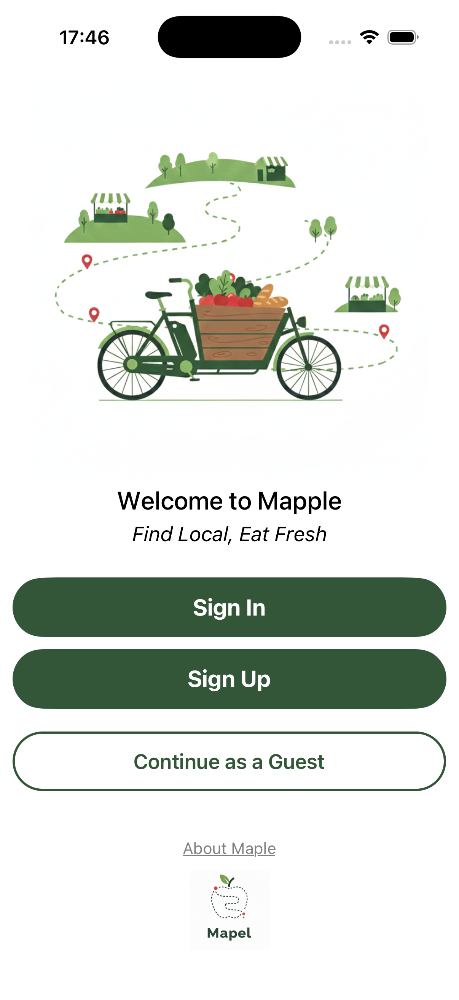
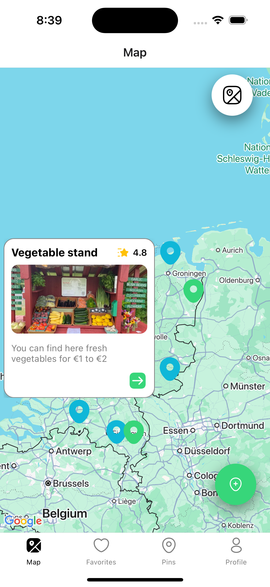
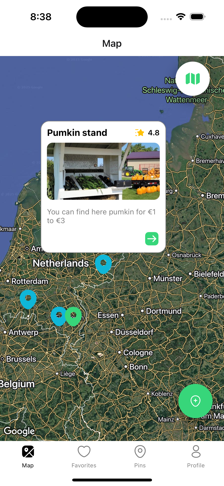
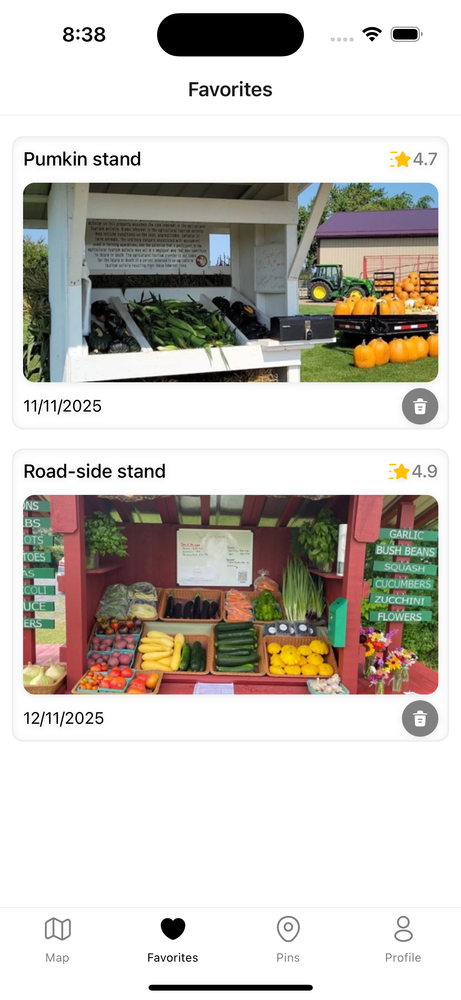
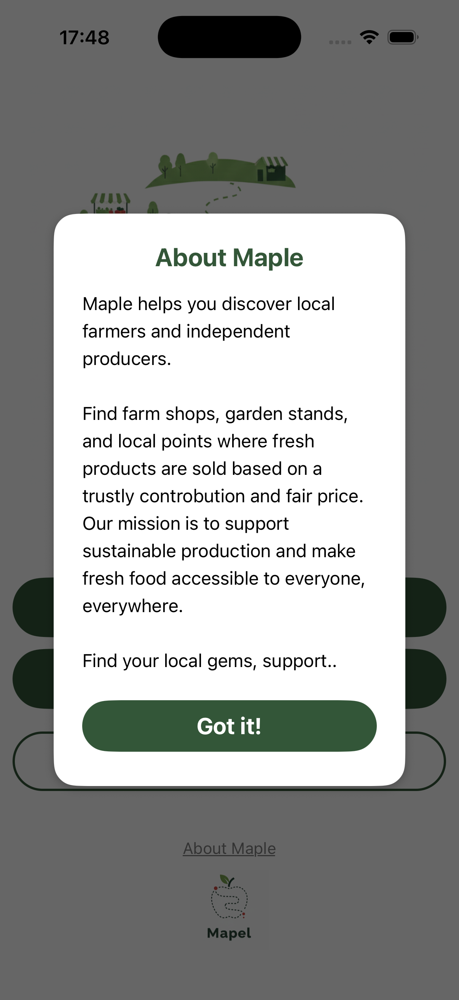
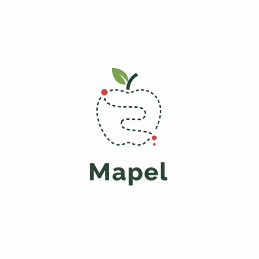

# 🌿 Maple - Local Produce & Farm Tracker

**Maple** is a community-driven mobile application designed to bridge the gap between local producers and consumers. Whether it's a farm-gate shop, a seasonal harvest stand, or a local producer's point, Maple allows users to discover, pin, and share these fresh food locations on a map.

Support local producers and find the freshest products directly from the source!

---

## ✨ Features

- 📍 **Explore:** Discover local farm stands and producers near your current location.
- 📸 **Contribute:** Found a new producer? Take a photo and pin their location for the community.
- 🔐 **Secure Auth:** Seamless user experience with Firebase Authentication.
- 🌍 **Real-time Map:** Live updates and interactive markers powered by Cloud Firestore.
- 🎨 **Modern UI:** Minimalist and intuitive design using Iconsax and smooth animations.
- 🛠 **Smart Permissions:** User-friendly camera and location access management.

---

## 📸 Screenshots

| Launch Screen | Map View 1 | Map View 2 |
| :---: | :---: | :---: |
|  |  |  |

| Favorites | About Maple | Brand Logo |
| :---: | :---: | :---: |
|  |  |  |

---

## 🛠️ Tech Stack & Dependencies

### **Core**
- **React Native (0.76.3)**: Robust cross-platform mobile framework.
- **JavaScript (ES6+)**: Developed with modern JavaScript patterns.

### **Backend & Storage**
- **Firebase Auth**: Secure login and user registration.
- **Cloud Firestore**: Real-time NoSQL database for syncing producer locations and details.
- **Async Storage**: Local persistence for user preferences.

### **Navigation & UI**
- **React Navigation**: Dynamic routing with Stack and Bottom Tab navigators.
- **Iconsax & SVG**: Scalable vector icons for a premium look.
- **RN Animatable**: Engaging UI transitions and interactive elements.
- **RN BootSplash**: Smooth and professional application launch.

### **Map & Hardware Integration**
- **React Native Maps**: High-performance Google Maps / Apple Maps integration.
- **Geolocation**: Precise user positioning for finding nearby products.
- **Image Crop Picker**: Easy-to-use camera and gallery interface for uploading produce photos.

---

## ⚙️ Installation & Setup

Follow these steps to run the project locally:

### 1. Clone the Repository
```bash
git clone https://github.com/MIR-HAN/ReactNative-MapApp.git
